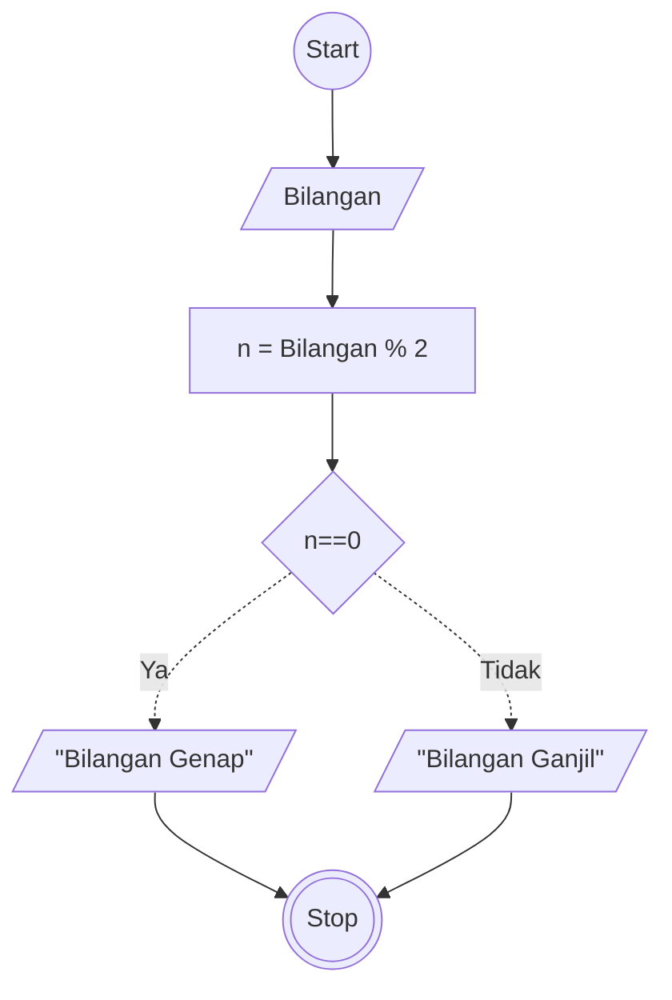

# Algoritma
## Menentukan Ganjil Genap Deskriptif

Algoritma ini untuk menentukan bilangan ganjil dan genap secara Deskriptif

1. Mulai
2. Masukkan Bilangan
3. Tampung nilai n dari hasil Bilangan di Modulus 2
4. jika nilai n hasilnya 0, outputkan bilangan genap
5. jika tidak outputkan di bilangan ganjil
6. selesai

## Menentukan Ganjil Genap Flowcart

Algoritma ini untuk menentukan bilangan ganjil dan genap menggunakan flowchart


## Menentukan Ganjil Genap PSEUDO-CODE

Algoritma ini untuk menentukan bilangan ganjil dan genap menggunakan Pseude-Code

```pseudo
DECLARE Bilangan: INTEGER
DECLARE n: INTEGER


INPUT Bilangan
n <- Bilangan % 2

IF n==0 THEN
    OUTPUT "Bilangan Genap"
ELSE
    OUTPUT "Bilangan Ganjil"
ENDIF


```
