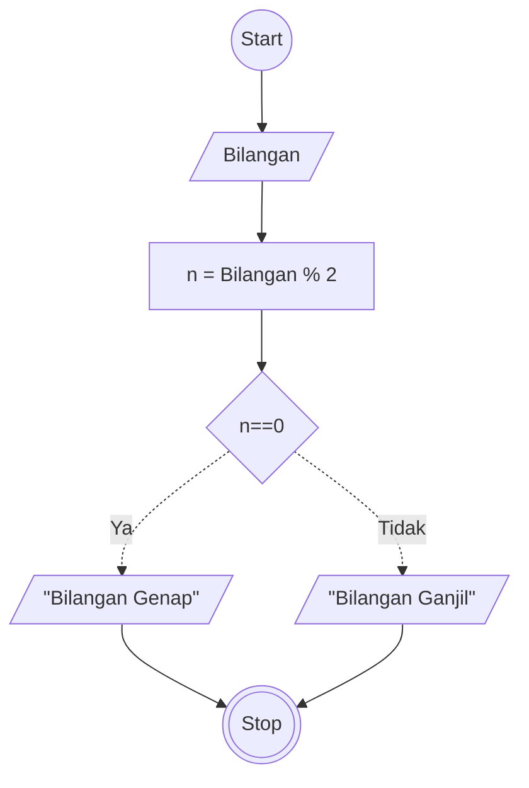

# Algoritma
## Menentukan Ganjil Genap Deskriptif

Algoritma ini untuk menentukan bilangan ganjil dan genap secara Deskriptif

1. Mulai
2. siapkan deretan angka yang ingin ditentukan bilangan ganjil / genap
3. menentukan bilang genap: jika bilangan bisa habis dibagi 2, Kelompokkan di bilangan genap
4. lalu sisanya kelompokkan di bilangan ganjil
5. selesai

## Menentukan Ganjil Genap Flowcart

Algoritma ini untuk menentukan bilangan ganjil dan genap menggunakan flowchart


## Menentukan Ganjil Genap PSEUDO-CODE

Algoritma ini untuk menentukan bilangan ganjil dan genap menggunakan Pseude-Code

```pseudo
DECLARE Bilangan: INTEGER
CONSTANT n = Bilangan % 2

INPUT Bilangan

IF n==0 THEN
    OUTPUT "Bilangan Genap"
ELSE
    OUTPUT "Bilangan Ganjil"
ENDIF


```