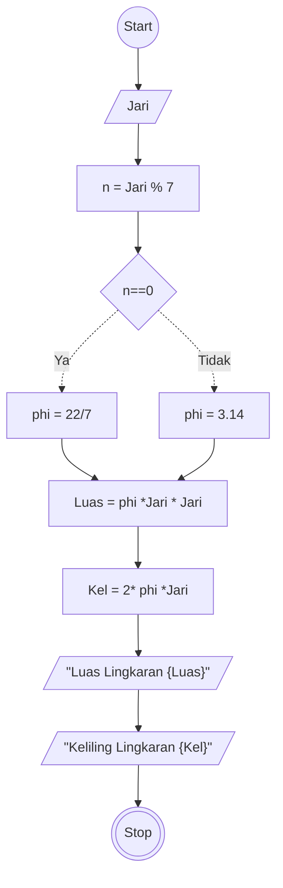

# Algoritma
## Hitung Luas dan Keliling Lingkaran Deskriptif

Algoritma ini digunakan untuk menghitung luas dan keliling lingkaran

1. Mulai
2. masukkan nilai Jari - jari lingkaran
3. kita tampung nilai n sebagai hasil dari nilai jari jari di modulus 7
4. jika nilai n hasilnya 0 maka nilai phi sebagai 22 dibagi 7
5. Jika tidak maka nilai phi sebagai 3.14
6. Hitung luas dengan rumus phi dikalikan Jari jari kuadrat
7. Hitung Keliling dengan rumus: 2 dikalikan phi dikalikan jari jari
8. selesai

## Hitung Luas dan Keliling Lingkaran Flowchart

Algoritma ini untuk menentukan bLuas dan Keliling Lingkaran menggunakan flowchart


## Hitung Luas dan Keliling Lingkaran Pseudo-Code

``` pseudo
DECLARE Jari: INTEGER
DECLARE n: INTEGER
DECLARE Luas: DOUBLE
DECLARE Keliling: DOUBLE

INPUT Jari
n <- Jari % 7

IF n==0 THEN
    CONSTANT phi = 22/7
ELSE 
    CONSTANT phi = 3.14
Luas <- phi * Jari * Jari
Keliling <- 2 * phi * Jari

OUTPUT "Luas Lingkaran", Luas
OUTPUT "Keliling Lingkaran", Keliling

```
