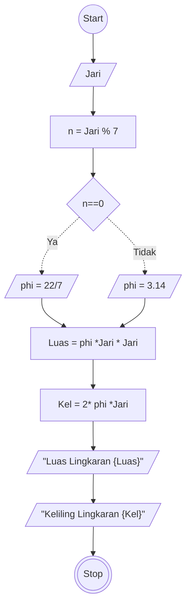

# Algoritma
## Hitung Luas dan Keliling Lingkaran Deskriptif

Algoritma ini digunakan untuk menghitung luas dan keliling lingkaran

1. Mulai
2. masukkan nilai Jari - jari lingkaran
3. gunakan nilai phi jika jari jari nilainya ketika dibagi 7 sisa pembagian adalah 0 gunakan nilai phi sebagai 22 dibagi 7
4. selain itu gunakan nilai phi sebagai 3.14
5. Hitung luas dengan rumus: phi dikalikan Jari jari kuadrat
6. Hitung Keliling dengan rumus: 2 dikalikan phi dikalikan jari jari
7. selesai

## Hitung Luas dan Keliling Lingkaran Flowchart

Algoritma ini untuk menentukan bLuas dan Keliling Lingkaran menggunakan flowchart

