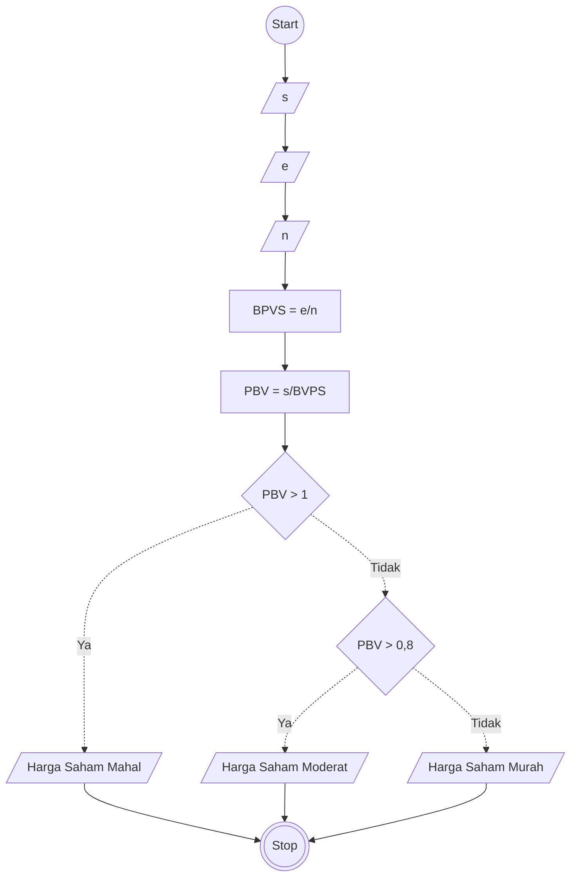

# Algoritma Program Untuk Menghitung Nilai Valuasi Saham
## Deskriptif

Algoritma ini menghitung nilai valuasi saham apakah Murah atau Mahal dengan algoritma Deskriptif

1. Mulai
2. Masukkan Nilai Harga Saham dan tampung sebagai nilai s
3. Masukkan Nilai Total Ekuitas dan tampung sebagai nilai e
4. Masukkan nilai jumlah saham beredar dan tampung sebagai nilai n
5. Cari nilai dari BVPS dengan rumus nilai e dibagi nilai n
6. Cari nilai PBV dengan rumus nilai s dibagi nilai BVPS
7. Jika nilai PBV lebih dari 1 maka berikan Output Harga saham Mahal
8. Jika nilai PBV lebih dari 0,8 maka berikan Output Harga Saham Moderat
9. Selain itu maka berikan output Harga Saham Murah 
10. Selesai

## Flowchart

Algoritma ini menghitung nilai valuasi saham apakah Murah atau Mahal dengan algoritma Flowchart

