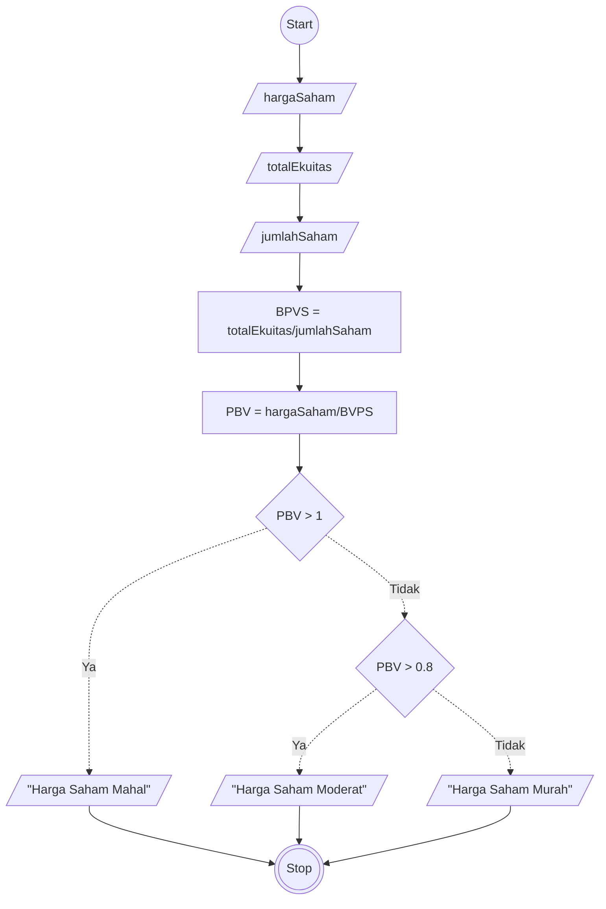

# Algoritma Program Untuk Menghitung Nilai Valuasi Saham
## Deskriptif

Algoritma ini menghitung nilai valuasi saham apakah Murah atau Mahal dengan algoritma Deskriptif

1. Mulai
2. Masukkan Nilai Harga Saham dan tampung sebagai nilai hargaSaham
3. Masukkan Nilai Total Ekuitas dan tampung sebagai nilai totalEkuitas
4. Masukkan nilai jumlah saham beredar dan tampung sebagai nilai jumlahSaham
5. Cari nilai dari BVPS dengan rumus nilai totalEkuitas dibagi nilai jumlahSaham
6. Cari nilai PBV dengan rumus nilai hargaSaham dibagi nilai BVPS
7. Jika nilai PBV lebih dari 1 maka berikan Output Harga saham Mahal
8. Jika nilai PBV lebih dari 0,8 maka berikan Output Harga Saham Moderat
9. Selain itu maka berikan output Harga Saham Murah 
10. Selesai

## Flowchart

Algoritma ini menghitung nilai valuasi saham apakah Murah atau Mahal dengan algoritma Flowchart



## Pseudo-Code

Algoritma ini menghitung nilai valuasi saham apakah Murah atau Mahal dengan algoritma Pseudo-Code

``` pseudo

DECLARE hargaSaham: INTEGER
DECLARE totalEkuitas: INTEGER
DECLARE jumlahSaham: INTEGER
DECLARE BPVS: REAL
DECLARE PBV: REAL

INPUT hargaSaham
INPUT totalEkuitas
INPUT jumlahSaham

BPVS <- totalEkuitas/jumlahSaham
PBV <- hargaSaham/BPVS

IF PBV > 1 THEN
    OUTPUT "Harga Saham Mahal"
ELSE IF PBV > 0.8 THEN
    OUTPUT "Harga Saham Moderat"
ELSE
    OUTPUT "Harga Saham Murah"
ENDIF
```
